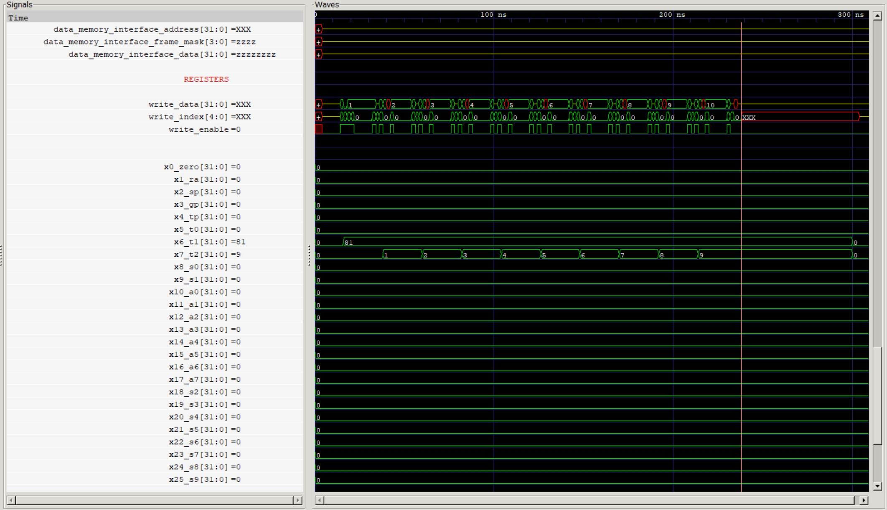

Computer Organization - Spring 2024
==============================================================
## Iran Univeristy of Science and Technology
## Assignment 1: Assembly code execution on phoeniX RISC-V core

- Name: Yasaman Nemati
- Team Members: Elham Estiry / Sanaz motie
- Student ID: 99413236
- Date: 28/05/2024

## Report

### Quick Sort
Quic kSort Algorithm in Assembly:
This document provides a detailed explanation of an implementation of the Quic kSort algorithm in assembly language. 

Main Routine:
The main routine initializes the stack pointer, stores the array values in memory, and then calls the QUICKSORT function. After sorting, it exits the program.

QuickSort Function:
The QUICKSORT function recursively sorts the array. It follows the typical QuickSort structure: it partitions the array and then recursively sorts the subarrays.

Partition Function:
The PARTITION function partitions the array around a pivot element and returns the index of the pivot. It ensures that elements less than the pivot are on its left, and elements greater than or equal to the pivot are on its right.

Explanation
1.	Initialization and Array Setup:
•	The stack pointer is initialized.
•	Array values {40, 30, 10, 70, 20, 60, 80} are stored in contiguous memory starting from address 0x0.
•	The start (a1) and end (a2) indices are initialized for the sorting process.
2.	QUICKSORT Function:
•	Saves the return address and registers.
•	Checks if the start index is greater than or equal to the end index. If so, the function returns.
•	Calls the PARTITION function to partition the array.
•	Recursively calls QUICKSORT for the subarrays before and after the partition index.
3.	PARTITION Function:
•	The pivot element is chosen as the last element of the array segment.
•	The array is rearranged so that all elements less than the pivot are to its left and all elements greater are to its right.
•	Swaps are performed as necessary to maintain the order.
•	Returns the partition index.
4.	Exit:
•	The program is terminated using ebreak.
This assembly code effectively demonstrates the QuickSort algorithm, sorting an array in a low-level programming environment.

### Integer Square Root
Integer Square Root Algorithm in Assembly
This RISC-V assembly program calculates the integer square root of a given input number using a simple iterative method. The integer square root of a non-negative integer 𝑛n is the largest integer 𝑥x such that 𝑥2≤𝑛x2≤n. The algorithm starts with an initial guess of 0 and increments the guess until the square of the guess exceeds the input number. This program is an example of how basic control flow and arithmetic operations can be implemented in assembly language to solve a mathematical problem.

Data Section:
•	This section defines the data segment. input is a word (32-bit integer) containing the value 81. This is the number for which we want to calculate the square root.

Text Section:
•	This section defines the text segment, where the code resides. The .globl _start directive declares the entry point of the program.

Entry Point:

•	la t0, input loads the address of input into register t0.
•	lw t1, 0(t0) loads the value at the address in t0 (which is 144) into register t1. Thus, t1 holds the value of n.

Initialize Variables:
 
•	li t2, 0 initializes t2 to 0. This will be the current guess for the square root.
•	li t3, 1 initializes t3 to 1. This will be the increment value used to compute the next guess.

Square Root Calculation Loop:
 
•	add t4, t2, t3 computes t4 = t2 + t3, which means t4 = x + 1.
•	mul t5, t4, t4 computes t5 = t4 * t4, which means t5 = (x + 1) * (x + 1).
•	bgt t5, t1, end checks if (x + 1)^2 is greater than n. If it is, the program jumps to the label end.
•	addi t2, t2, 1 increments x by 1.
•	j sqrt_loop jumps back to the start of the loop to repeat the process.

End of Program:
•	When the loop ends, the final value of x (which is in t2) is the integer square root of n.

